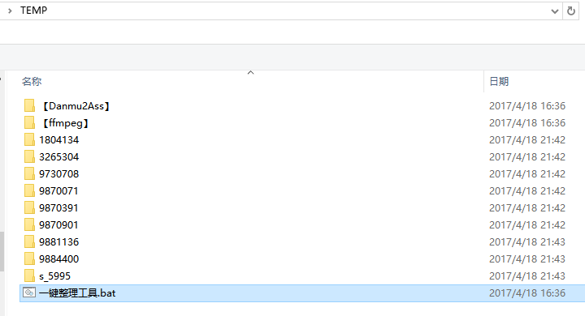
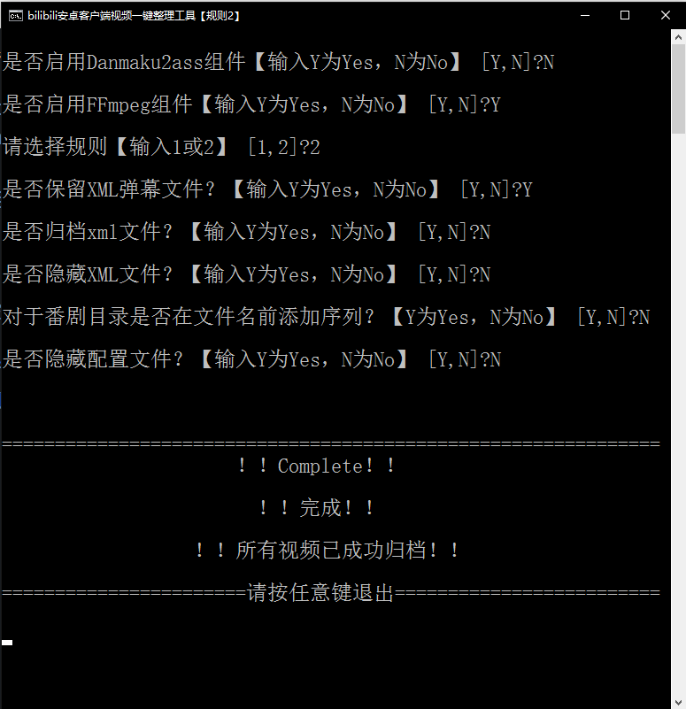
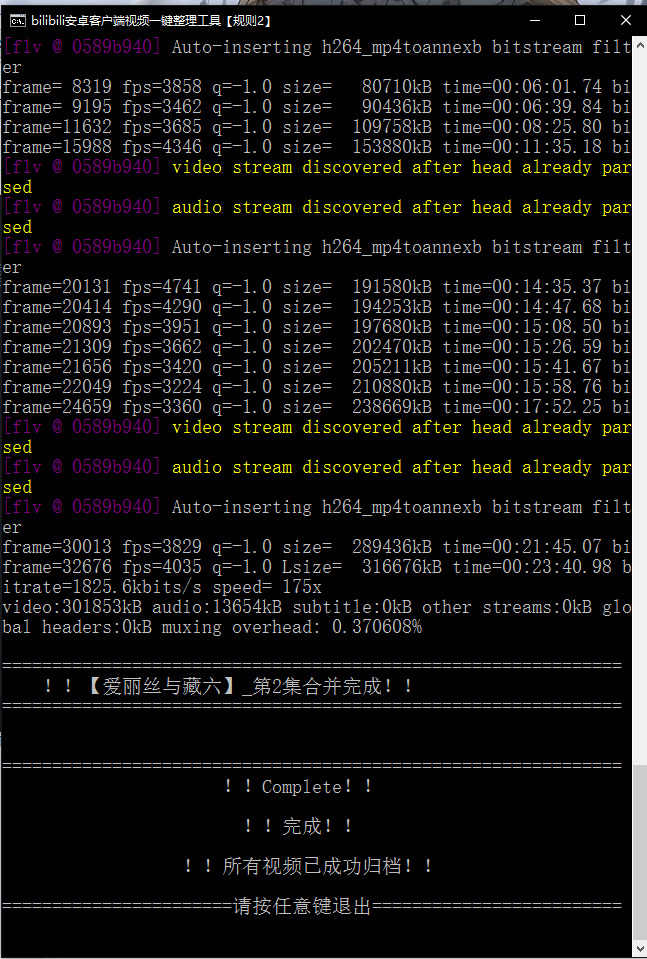
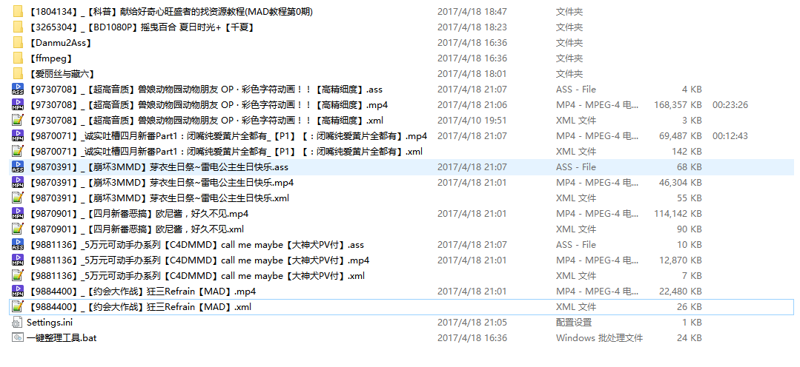
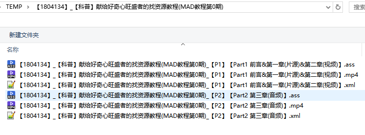
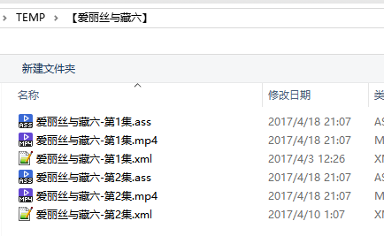
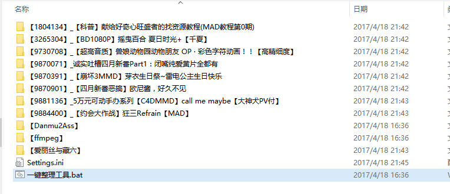
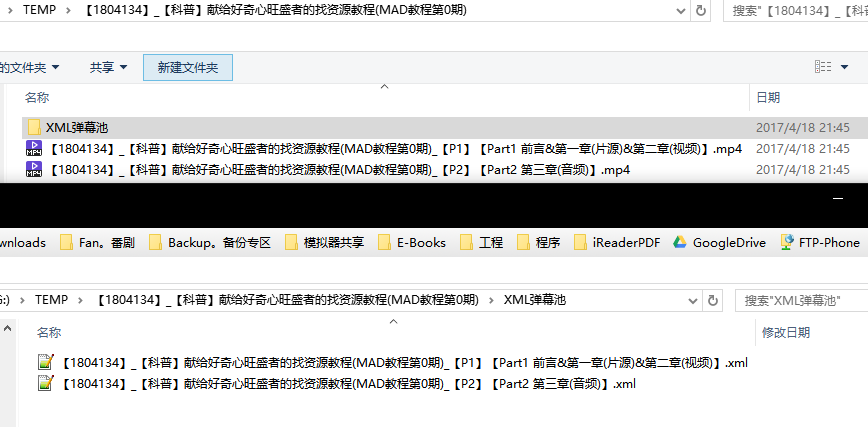
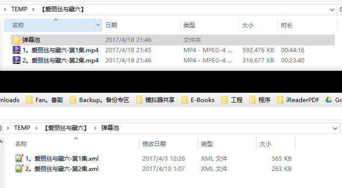

# BiliBili安卓客户端缓存一键整理工具

[**下载：Latest Release**](https://github.com/miyouzi/bilibili_organizer/releases)

弹幕播放器推荐：
- [**弹弹Play**](http://www.dandanplay.com/)
- [**BiliLocal（似乎已停止更新）**](https://github.com/AncientLysine/BiliLocal)

## 功能
- 一键执行B站安卓客户端缓存导入Windows后的整理工作。
- 支持将XML弹幕转换成ASS。（使用Danmu2Ass，需要 .NET Framework 4.0，Danmu2Ass 2014年后已没有更新，部分弹幕文件会转换失败，不推荐启用）。
- 支持自动合并分段视频。（使用ffmpeg，推荐开启）
- 两种整理规则。
- 支持将弹幕文件舍弃。
- 支持隐藏弹幕文件（[**弹弹Play**](http://www.dandanplay.com/)可以自动载入同名隐藏弹幕并播放， [**BiliLocal**](https://github.com/AncientLysine/BiliLocal)不行）
- 番剧另整理成单独文件夹,支持在剧集前添加序列。
- 内建检测，当出现意外导致批处理跳脱出工作目录时，自动停止，防止误伤其他文件。

## 整理规则

- 规则一
    - 直接将视频文件以及弹幕文件整理到工作目录下。

- 规则二
    - 为每个视频创建一个文件夹，并将视频文件以及弹幕文件归入其中。

- 番剧文件夹命名规则
    - 【番剧名】
    - 举例：
        - 【爱丽丝与藏六】
        - 【自由之翼 第二季（僅限台灣地區）】
    - 番剧视频文件命名规则（未开启 添加序列）
        - 番剧名-第n集.mp4
    - 番剧视频文件命名规则（开启 添加序列）
        - n。番剧名-第n集.mp4

- 若“归档xml（ass）文件”功能启用，会在视频所在目录创建一个“弹幕池”文件夹，并将xml（ass）文件归入其中。

- 对于多个P的视频，规则1和2技能效果是相同的，会新建一个以"【av号】_视频标题"命名的文件夹，将同一av号的视频都归到这一文件夹中。
- 文件夹命名格式：
    - 【av号】_视频标题
    - 举例：
    - 【33246】_【穿越】绿光
    - 【46000】_【萌神&PSG】CHOCOLAT

- 视频与弹幕文件命名格式：
    - 当视频有单个P，子标题为P1或者与视频标题相同时：
        - 【av号】_视频标题.扩展名
        - 举例：
        - 【46000】_【萌神&PSG】CHOCOLAT.mp4
        - 【46000】_【萌神&PSG】CHOCOLAT.xml

    - 当视频有多个P时：
        - 【av号】\_视频标题\_【Pn（n代表第几个P）】【子标题】.扩展名
        - 举例：
        - 【1804134】\_【科普】献给好奇心旺盛者的找资源教程(MAD教程第0期)\_【P1】【Part1 前言&第一章(片源)&第二章(视频)】.mp4
        - 【1804134】\_【科普】献给好奇心旺盛者的找资源教程(MAD教程第0期)\_【P2】【Part2 第三章(音频)】.mp4

- 由于windows不允许使用英文半角的 \\/:\*?”<>| 来命名文件，所以如果视频标题或者子标题中存在 \\/<>|*”这些字符将会被直接去掉，而英文半角的 :和? 将会换成中文半角的 ：和？ ，另外由于算法问题，标题中的如果存在英文半角的 ! 也会被去掉。

## 使用
- 本批处理设计运行于**简体中文**Windows（非简体中文系统可能会出现某种错误），建议Vista以上版本使用。（在首次引导用户配置时用到choice命令，WinXP无此命令，会直接生成配置文件，XP用户需要手动修改Settings.ini来配置）
- 使用前需要新建一个文件夹作为工作目录，将 **tv.danmaku.bili/download** （此目录下的文件夹即为B站缓存，一般视频以av号命名，番剧则以 “s\_” 开头）下的文件夹选取想要整理的部分以及本工具拷贝到此目录中，确保文件夹内无其他文件（批处理会遍历本目录下所有非 “【”开头的文件夹，如果放入其他非“【”开头的文件夹可能造成运行错误或文件被删除）
- 双击运行 **一键整理工具.bat** ，首次运行会引导配置，依据说明配置即可。
- **编码问题！** 批处理使用的是UTF-8编码，如果cmd显示乱码或提示无法输出，请更换cmd字体（右键cmd标题栏 》 属性 》 字体 ）。如果显示不完全，请用滚轮上下滚动。另外，即使cmd显示不正常，也不影响批处理运行。

## 效果图
### 整理前

### 首次使用引导用户设置界面

### 执行完成界面

### 使用规则1（演示配置如下）
- 启用Danmaku2ass （可以看到部分XML未成功转换）
- 不归档XML/ASS文件
- 不隐藏XML/ASS/配置文件
- 对番剧不添加序列

- **工作目录效果：**

- **多P视频目录效果：**

- **番剧目录效果（未添加序列）**  

### 使用规则2（演示配置如下）
- 禁用Danmaku2ass
- 归档XML/ASS文件
- 不隐藏XML/ASS/配置文件
- 对番剧添加序列

- **工作目录效果：**

- **多P视频目录效果：**

- **番剧目录效果（添加序列）**

